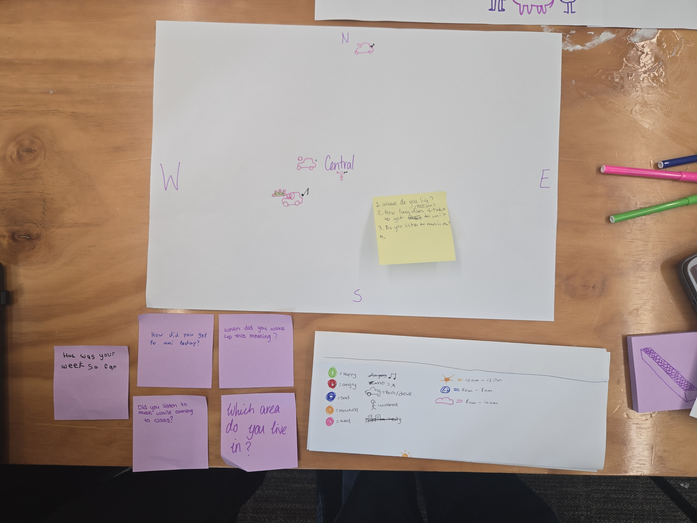
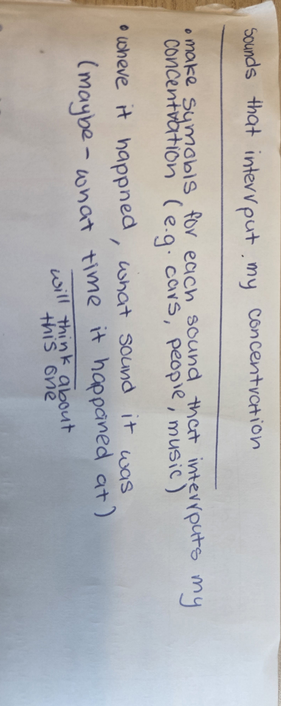
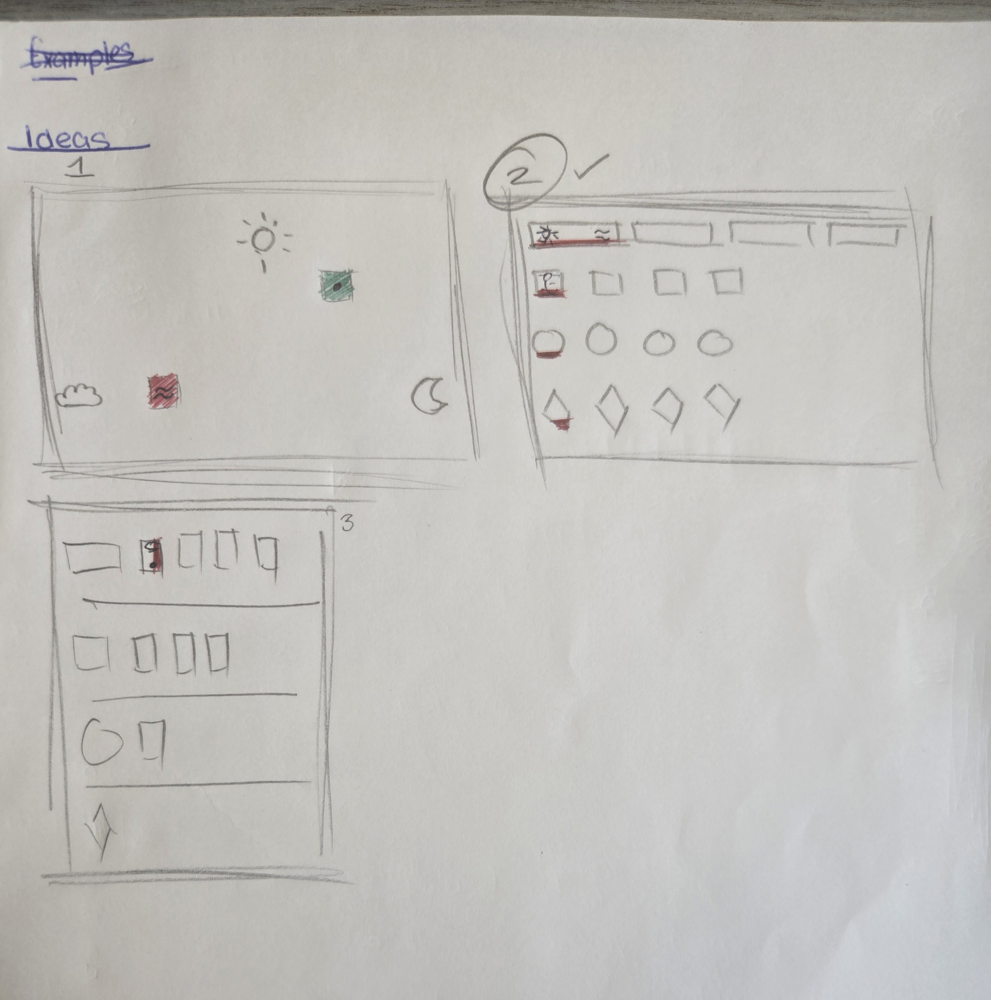
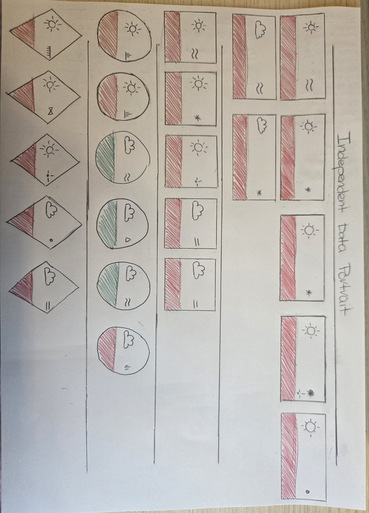
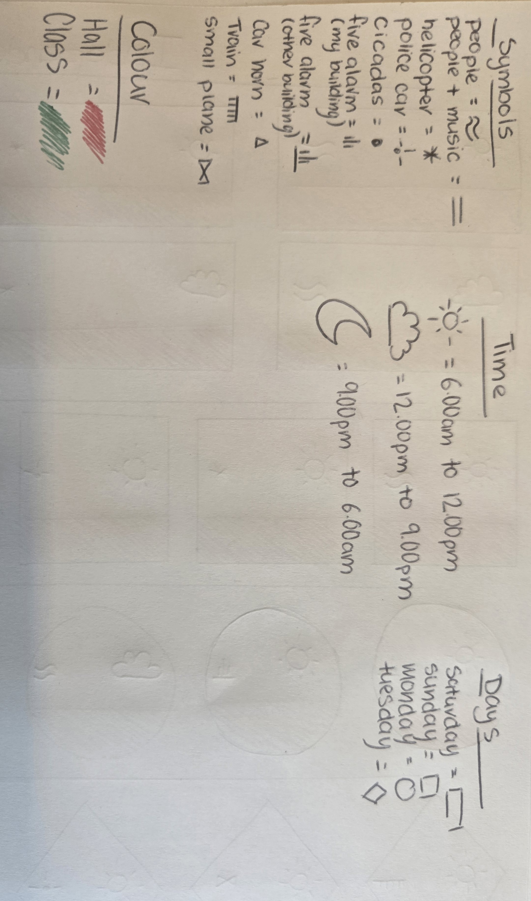

[← Back to Home](../index.md)

week one
Friday 6rd march - studio 1 
overview of the studio
In the studio we were given a task of getting into a group of four to five people where we would collaborate together to come up an make a hand drawn data visualisation that would be made entirely from data, Each person in the group was to come up with an question that would be personal but low stack which was to be done anonymous. (Group- gemma, nada, jimmy, me)

The questions were - how was your week so far?, how did you get to uni today?, when did you wake up this morning?, did you listen to music while coming to class? and which area do you live in.

The we moved onto allocating different colour to different moods (e,g green-happy red-angry) and making symbols that related to the questions we came up with (e.g car-buses or drove person-walked) from there each off us answered the questions we had written down. 
my group's data.

From there we were to swap with another group and try to decipher what there symbols and colour meant or represented and my group was able to get one of them right while for some of them we were close to guessing what they meant while for the other we were totally wrong about them.
Other group's data. 

we were given some question to answer about the other group.
- What can you learn about the people in this group from their data portrait?
- What surprised you?
- What questions do you have for them?
- Can you tell who is who?
these were our answer to them 

**Independent Study**

For this task i have to make my own data portrait that is an hand draw visualisation of my own personal data that i will collect over several days. For this independent data portrait i will pick an aspect of my life which i don't pay close attention to which i will record over four to five days. 

The topic that i chose to record over the course of 4 days was sounds that interrupt my concentration beacuse i wanted to see how often it would occur throughout my day.

This is the data that i collected over the course of 4 days i wrote all the sound that interrupted my concentration, where it happened and what time it happened at. I chose to do this because i would notice things i would usually overlook and writing down each sound with where and when it happened also helped me to understand what distracted me the most and how often it would happen throughtout my day.

Once i had collected all the data, i then wrote down all the sounds onto one pages to visually see all the things that interrupted me. After that i began creating different symbols to represent all the different sounds. some of the symbols were inspired by the sound itself for example the two wave line for people was people walking the trail that was near my room. i also make symbols for each day i collected data, what time i got interrupted and i also allocated colours to where it happened.

I started by sketching different ideas for how I wanted my hand‑drawn data visualisation data page to look like. I came up with three concepts, The first idea had three different times of day placed around the page, with coloured boxes with symbols showing where and how my concentration was interrupted and i didn’t choose this design because I felt it would become too busy and hard to read. My second idea used different shapes to represent each day, with each shape coloured and marked with symbols showing the time and the sound that interrupted my concentration this is the design I ended up choosing because it was the clearest, easiest to understand, and visually the most appealing to me. The third idea also used different shapes for each day, but placed coloured rectangles beside them to show what time and sound interrupted my concentration and decided against this one because I just didn’t like the layout of it or how it looked.

This is the final result of my independent data portrait that i did, and overall i am really happy with how it came together. Out of the three concepts I made, this one was the easiest for me to read and understand, and I think it presents the information in the best and most visually appealing way. 

**Reflection**

I chose to record sounds that interrupt my concentration because it is a aspect of my everyday life which I usually ignore or overlook. By paying attention to the interruptions I get to understand what distracts me the most, how often it happens and whether it is certain times or places that make it harder for me to concentrate.

Collecting the data was a really interesting process because it made me notice alot of things I would usually overlook like by paying more attention to the sounds that interrupted my concentration and writing them down I became a bit more aware of how often these distractions would happen and how they would affect my focus. Visualising the data was also interesting as it had helped me to see patterns, showing where it was the noisiest and what time of day my concentration was interrupted the most.

What i noticed while doing this project was that there was a small group of sounds that kept interrupting my concentration repeatedly over the course of four days as where before starting i had expected there to be alot more variety of sounds that interrupted my concentration but while doing this i saw the same few sounds that were the most common would repeat throughtout the day and interrupt my concentration.

For data collection I chose only to focus on the sounds that interrupt my concentration along with the time it happened and the place. This choice emphasises patterns in my interruptions showing me which noises affected me the most and when that happened and by narrowing it down to just the sounds, i had left out other thing that could influence my concentration like what i was working and how long i had already been working so it makes the data easier to visualise.

This exercise relates back to data humanism and *Dear Data* project because it transformed personal experiences into meaningful hand drawn data. By tracking the sounds that interrupted my concentration i turned a small part of my everyday life into a visual story which relates back to data humanism. This also relates to *Dear Data* as just like the artists, I also collected personal data throughout the week and represented it through hand drawn visualisations.
