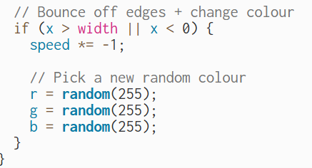

# Week 02

[← Back to Home](../index.md)

friday 13 march - studio 2
overview of the studio 
in the studio we learned how to code using a website called p5.js where we got to explore coding fundamentals and interactive DOM elements such as buttons, sliders, text inputs and to create text sketches that respond to user input.

I first spent some time getting use to with using p5.js before attempting to do a simple sketch that used at least three different types of shapes. I also experimented with using different colours, sizes, and the positionings of each shape. And this is was i did, i coded 3 different shapes in 3 different colours and put them in different positions.
[shapes](../assets/week-02/different%20shapes%20.png)[code](../assets/week-02/code%20shapes.png)

Once i became comfortable with using p5.js i moved onto learning to code DOM elements so i could create a sketch that at least uses two interactive controls that change something on the canvas such as create button, slider or input. What i ended up doing was making a code using slider and input. The slider controlled the size of the circle making it bigger and smaller and the input box allowed me me to type text that would appear under the circle i used the examples the teacher gave us as guidelines on what to do.

From there we moved onto vibe code an interactive sketch using LLM(eg Gemini, ChatGPT, Claude) to help build more of a ambitious interactive sketch in p5.js from there put the code into p5.js and run the code and add features to the code one at a time. So i ai to generate me a code for p5.js and it gave me a code that makes a circle move from left to right. 
## AI Usage Statement Figure 1. Microsoft (2026). Give me a code for p5.js [AI-generated prompt]. Microsoft Copilot. 
[ai](../assets/week-02/ai.png)
from there i started to add my own features to the code and the feature 
i added was making the circle change colours every time it hit one of the sides so to do that i added this code. 

which created variables for the red, green and blue values fo the circles colours and allowing thesketch know to change the colour of the circle when it hit a side. and i also add this code 

which checked when the circle hit one of the sides and when it does it reverses the direction and makes the circle a new random colour. 

**Independent Study**

For this independent study i was to take that data that i had collected for experiment 1 and use is as a basis for a interactive p5.js sketch where i had to try and translate my hand drawn data portrait into something some can explore, control and or manipulate throught different interactive elements. 

First, i went back an reviewed the data i had collected last week and started to think about how i could translate it into a p5.js sketch. i drew a sketch on how i wanted to translate the data onto p5.js to help me visualise what i would look like and how i could code it onto p5.js  
[sketch](../assets/week-02/sketch.jpg)

Once i had finished the drawing and decided what i wanted the sketch on p5.js to include like a slider to change the size of the symbol and a dropdown menu to choose which symbols to show i then began to translate the ideas into code. Before starting to code my data in i lookee at some refernces on the p5.js website such as create slider, translate, arc, create select, position, fill, end shape and many more to help with coding my data onto p5.js. 

This part of the code set up the variables that the sketch relies on which includes the cell size for spacing the shapes, a slider to control the size of the symbols and the dropdown menu that filters which symbols appears

this part of the code represents the data portrait in code. Where each of the row corresponds to the rows of shape and each object soecified
what symbol would appear inside of the shapes and what this is doing is that it is telling p5.js what to draw and where to place it 

This part of the code sets up everything the sketches need to run. It creates the canvas, builds the symbols size slider and adds the dropdown menu.

This part of the code clears the background, reads the reads the slider, the dropdown and then draw out each of the shapes and the symbols.

This part of the code draws each of the shapes based on its type, diamond, circles, flag and square.

And lastly this part of the code draws all the symbols such as cloud, sun, wave, triangle, dot and the asterisk. Using simply shapes it handles the visual for each of the symbol so that the stetch can place them inside the shapes.

this is the final outcome of my sketch coded into the p5.js there were some problems with the code such as the colour of the diamond where the other shape are split into two colours the diamond stays a solid red colour  
## Use ai to try and fix a part of my code that wouldn't work (Figure 2. Microsoft (2026). Fix this code so that the diamond is split into colours white ontop and red on the bottom [AI-generated prompt]. Microsoft Copilot.)
and i did ask ai to help me fix this problem in which it gave me a code but instead of helping it caused errors to happen with my other coding i had done for the shapes 
[code ai gave me](../assets/week-02/code%20ai%20gave%20me%20.png)[code error](../assets/week-02/code%20error.png)
so i ended leaving the diamond as it didn't bother me to much but i still wished it was split colour like the other shapes overall i did find i some what easy to code as most of the code that i used were similar to the code out teacher taught and for some.[Data final](../assets/week-02/Data%20final.png)

once the code was finished i gave it to my flatmate to see and observe how they would interact with it. They first tried the slider making the shapes bigger and smaller and then they moved onto the dropdown men playing around with it by choosing different symbols to display. And from observing them i saw that the interactive elements of the sketch were clear, easy to use and engaging the for a exploration of the data.

**Reflective writing**

The data and visual aspects that i chose to work with from experiment 1 were the sounds that interupted my concentration, the shapes i used to represent the different days and the symbols i assignd to each of the sounds. The reason that i chose those thing beacuse the sounds were the main part of experiment 1, the shapes for the different days gave the data a clear structure and the symbols for sound because it allowed me to express those differences visually.

i decide to use the slider and the dropdown menu interactive elements after closely looking at the data collected and i wanted people to be able to focus on certain symbols without all the other symbols getting in the way which is why i felt the dropdown menu made the most sense  i also wanted people to be able to control how the symbols appear visually which is why i felt the slider also made the most sense.

People could explore the data in a way that the hand drawn data couldn't which was being able to filter specific symbols to reveal patterns that weren't really obvious in the hand drawn data and ajust the symbol size to be bale to see the symbols more closely and see the details that they have.

The way that i approached the coding was in a structured way by starting with the first part of the sketch and then coding each of the section step by step as i worked on the coding i learned that it was helpful to break and code in small and manageable part.

If i had more time i would like to further develop the split coloured shapes espically the diamond as i couldn't fully figure out how to divide it into two colours and i would also work on trying to match the number of shapes in the sketch to the same amount in my hand drawn data.