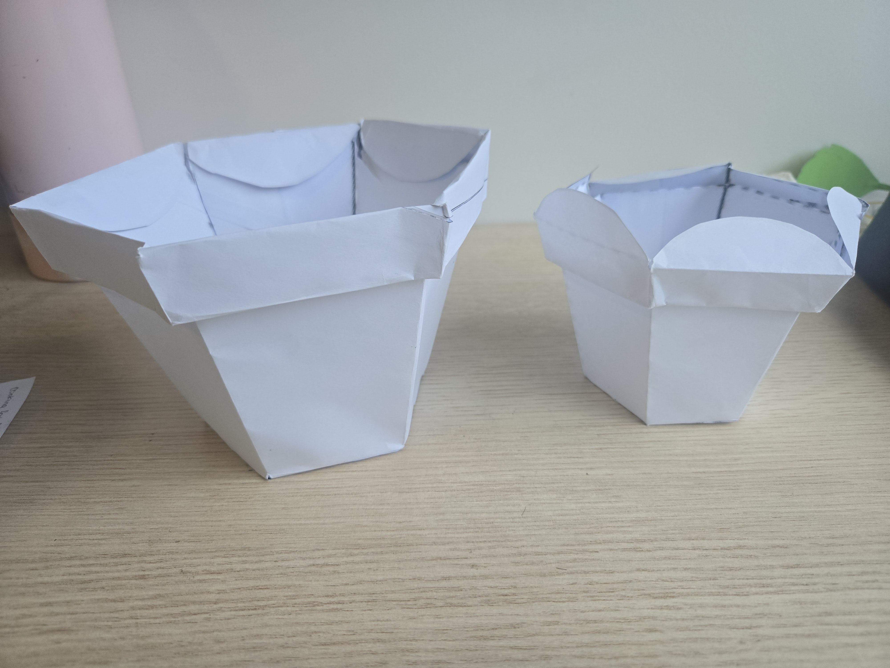

# Week 08

[← Back to Home](../index.md)

## Documentation 

##Class Activity##

## Progress Report

I shared my progress report with a small group of 4 including myself and after the five minutes were up the group began to answer the question they had for them and one of the main pieces of feedback that I had received was to expand the participatory element of my project. alongside the raindrop shaped paper someone recommended to add an additional shape such as the sun to offer up more variety and symbolism in how the contributions are represented. This idea gave me the thought on how small design choices could make the interaction feel more international and engaging.

**Critical Design Propositions**

For the critical design propositions we were to find a partner from a different group and briefing each other on what our projects are then critically thinking about the partner's work.

- What aspect of their approach is most interesting?
- What is least developed?
- Is there an alternative form (e.g. physical, screen-based, interactive) that could strengthen the work?
- How might their future scenario or intended impact be communicated more powerfully?
- What else would you change or do differently if this were your project?

(Had forgotten to ask my partners name)
My partner's work was that they are making a website where they could write down their emotions and where other people like their friends can also write down their emotions. 

**What aspect of their approach is most interesting?**

The most interesting about their approach is the collaborative and social layer where the website isn't just a display but is a space where multiple people can actively contribute

**What is least developed?**

From what I could see the least developed was the translation from the data input to the representation as I felt the website seems to be focused on collecting contributions but the visualisation and the emotional tone weren't fully articulated.

**Is there an alternative form (e.g. physical, screen-based, interactive) that could strengthen the work?**

yes i think so because they could add a digital system where someone adds their emotion/ feeling onto the website. It would trigger an physical change like light, movement or shapes that could make the contributions to the website feel more alive.

**How might their future scenario or intended impact be communicated more powerfully?**

At that moment I felt that the scenario felt more implied rather than expressed to make it more powerful. I think they could have framed the purpose more clearly like what are people contributing and what the future world does this website belong to.

**What else would you change or do differently if this were your project?**

if this was my project i take a different approach to it like instead of the simple display of an emotion i would make a creature like avatar that would embody the emotion of the person. The avatar would be built from sets of expressive parameters like the body shape would show if they are sad, happy, the posture of the body would show if they are alert, have low energy ect and this was how far i got before i had to show my partner what i had done and where they also showed me what they had done.

`*What i thought of his work*`

This was the idea that he came up with for my project imagining what he would do if it was his own project. He suggested about making the emotional data more visible by letting different emotions influence the growth and appearance of each of the leaves in the plant. This perspective had helped me see how the plant could be evolved beyond a static installation into something more dynamic and more responsive.

`*What he thought of my work*`

##Independent Study##

## Reflective Summary

the most significant feedback that i had received during the progress report was focused on expanding the participatory element thst my project has. As it was suggested that along with the raindrop shape paper that I will have so that people can write their acts of care, I could make a second shape like the sun and this idea has stood out to me because it deepens the symbolism of the project. I had originally chosen the raindrop because putting in the raindrop into the pot mimics that act of watering the plant in which it could be translated to doing an act of care. This feedback helped me to see that interaction with my project could become more richer and more expressive if there were multiple forms of care were represented through multiple shapes.

## Project Development

Building on from the reflective summary I continued developing my project by refining both the participatory system and the physical construction of the paper plant. The decision that I made was expanding the shapes as alongside the raindrop I will introduce a sun shaped paper as another way for the participants to write down their acts of care. These dual shapes will make the interaction more expressive and give the participants in choosing the type of care they want to contribute.

To support this direction that I was going in I returned to the technical skills gaps that I had identified in the week 6 road map especially the paper craft techniques.

A technical shift was committed to wire stems instead of the rolled paper stems. During the making sprint I had tested how the wire worked with the paper, how it would hold the curvature and how the different lengths of wire worked with the paper leaves. I also experimented further with different sizes of plant pots to which would fit the best and so it is big enough to fit the contributions that people will make.

**Wire stem test**

`*Wire stem test*`

**Two plant pots tests**

`*Two more plant pot tests*`