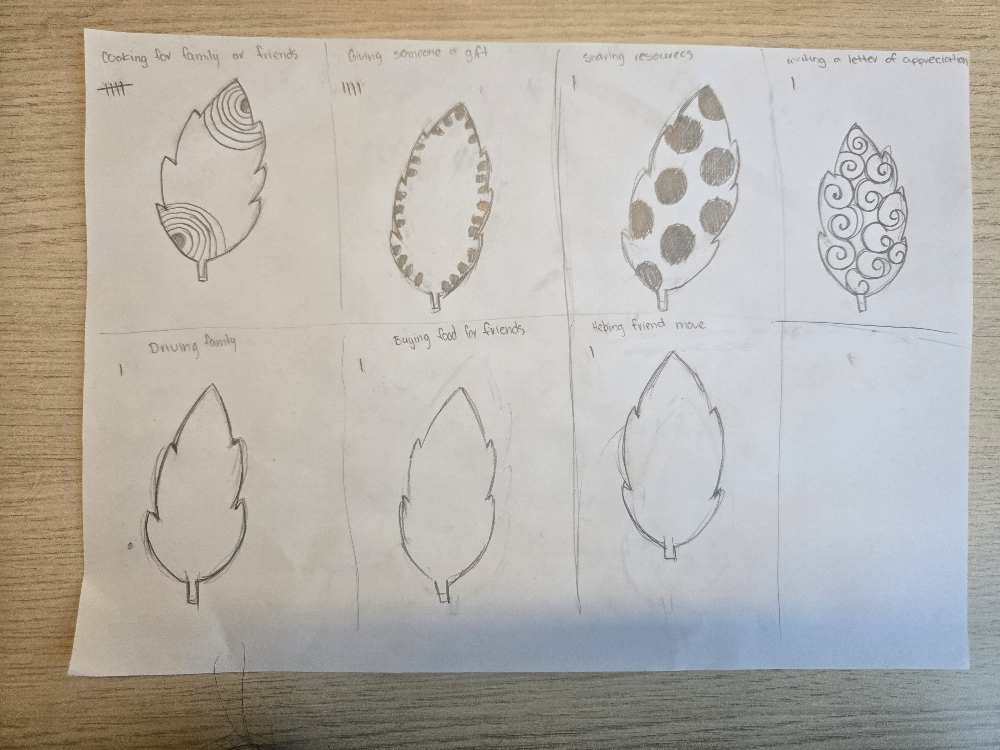
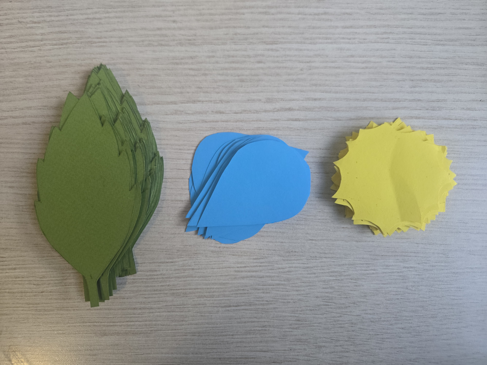

# Week 09

[← Back to Home](../index.md)

##In Class Activity##

## Project Statement: First Draft 

**Case Study**

For the case study we were to work in pairs and engage with the Xeno Computer 0.1: Labor case study by Tega Brain and Sam Lavigne. And our task was to analyse the work and respond to a set of question 

- what are the data sources used in this work?
- what is the future scenario it addresses?
- what does the statement argue about data and power?
- what might be the intended impact, and is this included in the statement 

and this was my answers to each of these questions 

**what are the data sources used in this work?**

The job market

**what is the future scenario it addresses?**

How in the future jobs would be generated for people 

**what does the statement argue about data and power?**

the case study argues that data is never neutral as it is produced through labour and shaped by power

**what might be the intended impact, and is this included in the statement**

challenges the assumptions about the effcieny and automation

## Drafting with NotebookLM

I created a new notebook in the notebookLM needed to add my reflective proposal along with my week 7 and 8 jouranl writing so that notebookLM can make a draft project statement but at that point i had yet to write my week 8 journal enrty so i only added my week 7 and reflective proposal. 

This was what NotebookLM had writtern
(photo of notebookLM)

**Evalution**

When reading through my draft project statement i had to make notes in responses the these questions 
- what is working well?
- what is missing or underdeveloped?
- what feels overly generalised or ai like? 
- what do you need to research further?

**what is working well?**

I was raally the way that notebooklm was able to explain my work really well 

**what is missing or underdeveloped?**

what was missing from the project statement was how i had decided to make the sun shaped paper where people could write down there acts of care.

**what feels overly generalised or ai like?**

When i went over the project statement i didn't feel like there wasn't any thing over that felt overly ai like. 

**what do you need to research further?**

At that monment i really didn't think i needed to research futher as i knew what i needed to do and get done.

**Pear Share**

My partner for the peer share said that my project statement was clear and compelling and that she was impressed by how well notebookLM was able to explain my work even with the little information i had given it. The main thing my partner felt what still needed to be resolved was just updating the project statement to include the new decisions that i have made like the addition of the sun shaped paper that goes alongside with the raindrop.

## Making Sprint 

During the 35 mintues making sprint i foucused on producing different pattern  what would represent the different acts of care from my dataset that i have collected and during the session i concentrated on developing final patterns outcomes using the shape, density and postions. what i had realised that most of my patterns had in some form had taken the shapes of circles but in the end theses designs now give my project the visual identity and help to connect the data more to the physical stucture of the plant. 

## Round Robin Rapid Reactions  

For this part of the class was to be divided into presenters and visitors where presenters would set up with there project statement darft and the outcome from the making sprint ready to show the other half of the class that would be the visitors. And i was in the group that would be the visitors first i walked around the classroom looking as the different making sprints that the presenters had made and there were some really interesting ones like one where they made a map showing how many stray cats live in the different parts of auckland.

After being the visitor i switched roles and became one of the presenters i had showed my making print and my project statement, there were quite a few people that came over to look at my work. The feedback that i had got was positive and several people said the project was heading in a great direction and that couldn't think of anything else that they could think to make the project even better but leo did suggest looking into making the project textured if people were going to ineract and touch the final outcome. 

but there were question that we as visitors we were to use to prompt the coversation but we only found out about the questions once we finshed doing the round robin rapid reaction.

## Independent Study 

**Project Development**

Throughtout this week i continued developing my project and made some progress to the components of the project. i made two new different sized plant pot and the bigger one became the final choice as i felt it was large enough to hold all the leavs without it being or looking overcrowed os from there i used thicker coloured paper to build the fianl plant pot. i also drew out and cut out  the raindrop, the sun and the leaf shpaes.

I had also bought and experimented with different wire structures for the stems. The first test had used a single wire but it felt to thin and lacked the stability i wanted, so then i tried two wires twisted together which i felt gave the stems more strength and fianlly i made another version using the twisted wire paired with the actual leaf size to see how they both looked together and i really love the way they looked and more towards the end of the week i began on drawing the differnet patterns for the acts of care.

**twp plants pots test**

**Final plant pot**

**Cutout of the leaves, raindrop ans sun**

**Stem tests**

**Leaf patterns**

**Progress report**

This is what i wrote in my progress report that i will be sharing next week to a small group of people

**where your project currently stands?**

So far i have made two more different sized plant pot with the last size being the perfect size, i have also made three different mock ups of my leaves i had just one wire, one having two wires twisted together and last with the leaves shape that i wanted and i started to draw my patterns for the different acts of care i have collected.

i also have made my fianl plant pot alson with my fianl leaves, raindrops and suns.

**your current darft project statement**

my current darft of the project statement is just the one that notebooklm wrote up as i have yet to start writing my own project statement beacuse i have been foucusing on making the final out bur i will use the notebook one as a guide to help me write my fianl project statement

**key developments and decisions since week 8**

the only decision i have made was to make sun for people to insert inside of the plant pot as per the feedback i got saying i could have more verations of cares for the plant and i went with it as i loved the idea of give more options that people could use to interact with

**Visual research**

**two or three question i want feedback on**

I only had one question to ask the group with was does the project i make will have the visual impact that i want 
and the answer that i got from moslty everyone was with all the elements that i have and inclued yes the prject will create the visual impact that i want with the people.