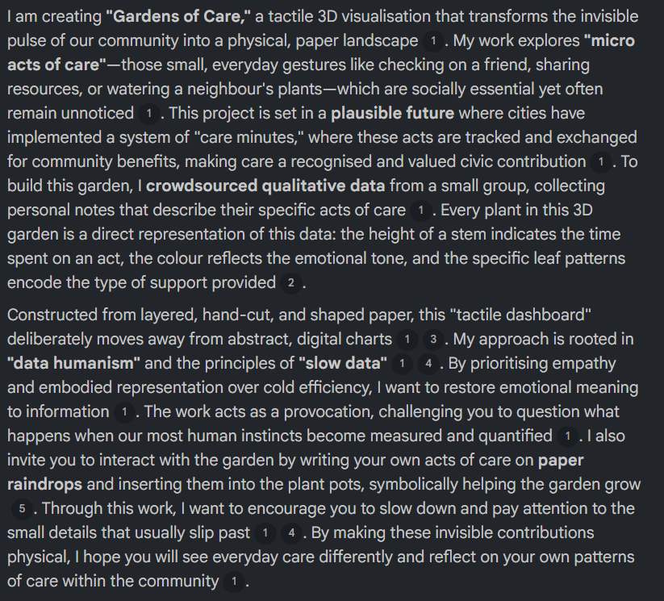

# Week 09

[← Back to Home](../index.md)

## Documentation 

##In Class Activity##

## Project Statement: First Draft

**Case Study**

For the case study we were to work in pairs, i worked with Gemma and we were to engage with the Xeno Computer 0.1: Labor case study by Tega Brain and Sam Lavigne. And our task was to analyse the work and respond to a set of question

- what are the data sources used in this work?
- what is the future scenario it addresses?
- what does the statement argue about data and power?
- what might be the intended impact, and is this included in the statement

and this was my answers to each of these questions

**What are the data sources used in this work?**\

The job market

**What is the future scenario it addresses?**

How in the future jobs would be generated for people

**What does the statement argue about data and power?**

the case study argues that data is never neutral as it is produced through labour and shaped by power

**what might be the intended impact, and is this included in the statement**

challenges the assumptions about the efficiency and automation

`*What i did on the miro board*`

## Drafting with NotebookLM

For this activity we were to use notebookLM to create a draft project statement. So i created a new notebook in the notebookLM  and needed to add my reflective proposal along with my week 7 and 8 journal writing so that notebookLM can make a draft project statement using that but at that point in time i had yet to write out my week 8 journal entry so i only added my week 7 and reflective proposal to notebookLM.

This was what NotebookLM had written

`*darft project statement*`

**Evaluation**

When reading through my draft project statement i had to make notes in responses the these questions
- what is working well?
- what is missing or underdeveloped?
- what feels overly generalised or ai like?
- what do you need to research further?

**What is working well?**

what worked really well was the way that notebooklm was able to explain my work really well with the little information I was able to give

**What is missing or underdeveloped?**

What was missing from the project statement was how I had decided to make the sun shaped paper where people could write down their acts of care.

**what feels overly generalised or ai like?**

When i went over the project statement i didn't feel like there wasn't anything over that felt overly ai like.

**What do you need to research further?**

At that moment I really didn't think I needed to research further as I knew what I needed to do and get done.

**Peer Share**

My partner Gemma for the peer share said that my project statement was clear and compelling and that she was impressed by how well notebookLM was able to explain my work even with the little information I had given it. The main thing my partner felt that still needed to be resolved was just updating the project statement to include the new decisions that I have made like the addition of the sun shaped paper that goes alongside with the raindrop.

For her i said that she could go and refine the future scenario so it fits more clearly with the direction of which her project is going and to also just explore what other possible future scenarios her project could sit with. I also suggested she make sure the project delivers the imapct that she wants people to have while looking at her project. 

## Making Sprint

During the 35 minutes making sprint I focused on producing different patterns that would represent the different acts of care from my dataset that I have collected and during the session I concentrated on developing final patterns outcomes using the shape, density and postions. what i had realised that most of my patterns had in some form taken the shapes of circles but in the end these designs now give my project the visual identity and help to connect the data more to the physical structure of the plant.

`*making sprint 2 outcome*`

## Round Robin Rapid Reactions  

For this part of the class was to be divided into presenters and visitors where presenters would set up with their project statement draft and the outcome from the making sprint was ready to show the other half of the class that would be the visitors. And I was in the group that would be the visitors first. I walked around the classroom looking at the different making sprints that the presenters had made and there were some really interesting ones like one where they made a map showing how many stray cats live in the different parts of Auckland but there were questions that we as visitors we were to use to prompt the conversation but we only found out about the questions once we finished doing the round robin rapid reaction.

After being the visitor I switched roles and became one of the presenters. I showed my making print and my project statement, there were quite a few people that came over to look at my work. The feedback that I had got was positive and several people said the project was heading in a great direction and that they couldn't think of anything else that they could think to make the project even better but Leo did suggest looking into making the project textured if people were going to interact and touch the final outcome.

## Independent Study

**Project Development**

Throughout this week I continued developing my project and made some progress to the components of the project. I made two new different sized plant pots and the bigger one became the final choice as I felt it was large enough to hold all the leaves without it being or looking overcrowded so from there I used thicker coloured paper to build the final plant pot. I also drew out and cut out  the raindrop, the sun and the leaf shapes.

I had also bought and experimented with different wire structures for the stems. The first test had used a single wire but it felt to thin and lacked the stability i wanted, so then i tried two wires twisted together which i felt gave the stems more strength and finally I made another version using the twisted wire paired with the actual leaf size to see how they both looked together and i really love the way they looked and more towards the end of the week i began on drawing the different patterns for the acts of care.

**twp plants pots test**

`*two plant pots tests*`

**Final plant pot**

`*final plant pot*`

**Cutout of the leaves, raindrop and sun**

`*cutout of leaves, raindrops and sun*`

**Stem tests**

`*More wire stem tests*`

**Leaf patterns**

`*Leaf patterns*`

**Progress report**

This is what i wrote in my progress report that i will be sharing next week to a small group of people

**where your project currently stands?**

So far i have made two more different sized plant pot with the last size being the perfect size, i have also made three different mock ups of my leaves i had just one wire, one having two wires twisted together and last with the leaves shape that i wanted and i started to draw my patterns for the different acts of care i have collected.

I also have made my final plant pot also with my final leaves, raindrops and suns.

**your current draft project statement**

my current draft of the project statement is just the one that notebooklm wrote up as i have yet to start writing my own project statement because I have been focusing on making the final out bur i will use the notebook one as a guide to help me write my final project statement

**key developments and decisions since week 8**

the only decision i have made was to make sun for people to insert inside of the plant pot as per the feedback i got saying i could have more variations of cares for the plant and i went with it as i loved the idea of give more options that people could use to interact with

**Visual research**

`*Visual research*`

This is what i kind of what i want my acts of care data patterns to look like with all the different colours for the different emotions and the unique patterns for the type of data 

**two or three question i want feedback on**

I only had one question to ask the group with was does the project i make will have the visual impact that i want
and the answer that i got from mostly everyone was with all the elements that i have and include yes the project will create the visual impact that i want with the people.
