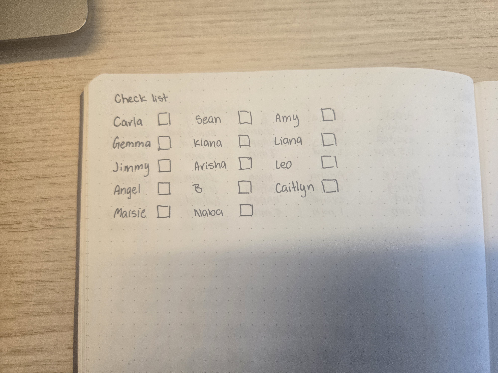

# Week 11

[← Back to Home](../index.md)

## Documentation 

##In Class Activity##

## Journal Review

For the journal review we are to work in pairs and review each others journal entries for weeks 6 to 10 using a check list to see if we have done both all the in class activities and independent study while also checking for clarity and completeness, an effective balance of visuals and the text and has the correct technical implementation. but since there was only three of us sitting at the table we did it in a pair of threes where i checked Eva's journal, my journal was checked by Naba and Naba's journal was checked by Eva

My partner Eva's journal was clear and detailed, showing some strong documentations of her process. She had explained what she did,why she did it,and what she changed along the way. The inclusion of photos provided with visual proof of the progress.

There were only two to three things missing mainly being the in class activity but overall her journal communicated a strong sense of development and awareness.

This was what my checklist looked like after my journal was looked over from Naba and the only thing that I was missing was the week 10 project development which at that time I still had to do.

(Add photo of checklist)

**Key Moments**

In the preparation for the studio consultation i was to re read my own journal and to identify three key moments that had shaped my project direction

A key decision that shaped my project was choosing to make the plant interactive rather than being just observational. This had shifted the project from being just a display into a participatory experience where people could actively contribute their own acts of care they have done and become part of the plant.

Leo's feedback about exploring texture had shifted my thinking about the materials and had made me realise how important tactility is to a project where people physically interact with it.

A key discovery connected back to Leo's feedback that I got was noticing how the textured paper that I had chosen for the leaves made them feel more expressive adding more depth to the overall plant. this had helped mt to understand that material qualities can carry also carry meaning just as the colours or shapes

## Practice Consultations

We were to work in pairs again and take turns interviewing each other using the question prompts given to us from  the class sides and we were to use these prompts as a guide and a script. And I again worked with Eva for the activity

My answers to these prompts that were asked to me

**Tell me about your project’s theme**

My project explores the acts of care that often go unnoticed in the day to day life. It showcases the small meaningful gestures that people do for one another like gifting,cooking or just helping people with a task.

**What is your data source? How did you access or collect it?**

My data comes from crowdsourcing and i had made a google form and sent it to my friends and flatmates asking them to share the acts of care that have done and using the google form made the process was much easier because all the responses were collected into one place which helped me organise and review without losing anything

**Tell me about a key moment in your design journey.**

In week 7 or 8 I had received the feedback encouraging me to add an interactive element to my project as before this it functioned only as something that people would look at but introducing the interactive element it allowed participants to contribute their own acts of care making the project more personal.

**How does your work challenge conventional ideas?**

My work challenges the conventional ideas because it uses 3D tactile project to make people notice the acts of care that usually go unnoticed and instead of presenting the data through charts or numbers my project turns the qualitative data into a physical experience that people can walk around and contribute to.

**What impact do you want your visualisation to have?**

I want people to look at the visualisation and notice the everyday acts of care that people usually overlooked or taken for granted for. My aim with the project is for people to slow down and recognize these small acts and appreciate them.

**What surprised you most in the making process?**

I was surprised that I didn't really encounter as many challenges throughout the making process that I would had expected. As I thought the project would be much harder to do, many of the steps felt manageable.

## Showcase Planning

For the showcase planning we were to add ourselves to the showcase miro board and mark our preferred location to install our work. And I had ended up choosing the table off to the side of the room and why I did that was because I needed a surface to put my project on and didn't need as much shape as other people needed.

`*showcase miro board*`

##Independent Study##

## Project Finalisation

**Leaves**

Since last week I have finished drawing on all the patterns designs for the acts of care onto each of the leaves. This stop had helped me to see how the patterns worked across all the leaves and how they visually communicate the tone of the data. And finishing this stage of the project made me feel a lot more cohesive as the leaves now clearly reflect the stories through the dataset.

`*all the leaves with the patterns on them*`

The only thing that I ended up changing was one of the colours that was linked to an emotion being yellow. After I had drawn the pattern onto the leaf I had realised that the yellow wasn't effective as the pencil marks that I made could still be seen through the yellow and the colour had almost disappeared against the green paper. Because of this i had switched the colour to orange which had created a much more of a stronger contrast and made the pattern easier to read and helped the emotion of the act of care stand out more clearly

This small adjustment had made me more aware of how important the material testing and the colour visibility are working with the physical data. This had reminded me that even the minor choices can significantly affect how the information that I want is communicated back to to the people.

`*the leaves where i used yellow and the new one with orange*`

**Stems**

In week 9 I had decided to make the stem from two wires twisted together and this gave the stems much more stability and allowed me to shape the leaf with a lot more control and create more of an natural curve. It also had helped me get the leaves to sit on a better angle.

`*the twisted wire stems*`

I have made a size chart for the wire length where each of the stem would increase by 2cm for every 10 minutes that were recorded like for example 10 minutes become 2 cm, 20 minutes become 4 cm, 30 minutes become 6 cm and so on which goes all the way up to 5 hours which becomes 60 cm. this gives the plant a clear consistent structure and makes the time based data immediately visible throughout the height of each of the stems but there was a problem that had occurred which was that i had quit a few people with time under 10 minutes and what i did to fix this was i added any number that was under 10 minutes would equal 2 cm and why i did was because i would have to remake the size chart and it would throw all the proportions of and would take me a lot more longer for me to make the chart again and this is why i decided that any number that was under 10 minutes would equal 2 cm.

`*the size chart for the stems*`

`*the different sizes stems there will be*`

I also made a checklist to help me keep track of which stem I have already glued to their corresponding leaves. This had helped me to stay organised especially since each person had two leaves and a specific wire length based on their time spent on doing acts of care. And by checking off each completed stem and leaf pair one at a time I could see who I had finished and who I still needed to do.

`*the checklist to help me keep track*`

I have also made two different leaves for each person, one leaf with the drawn patterns on top and the second plain leaf going underneath. This allows me to sandwich the wire between the two layers of leaves, securing it in place so that the stem is stable and the wire stays hidden and using this method makes the leaves look a lot more professional and clean. this also gives each of the leafs a bit more structure and helping it sit properly on the stem  

`*the two leaves and sire stem*`

When I had tried gluing the leaves together with the wire on the inside the wire had kept slipping out and wouldn't stay in place. I had realised this because I was using just some normal glue which wasn't strong enough to hold the wire in place securely between the paper leaves. To fix this I had added a small drop of superglues right where the wire sits between the two leaves and it worked out perfectly as the wire stayed in place.

From then on I had used normal glues for the surface areas of the leaves and a tiny drop of superglue at the attachment point on the leaves which gave a clean finish. And this process has also taught me that it is important to choose the right adhesive for the different parts of the project.

`*the stem that keeps falling out with the use of normal glue*`

`*the stem in place glued with superglue*`

The end result of gluing all the leaves and the stems together had turned out nicely and I genuinely am proud of how cohesive and expressive the final leaves look. Seeing everything assembled, the leaves, the wire stems, the colour choices made the whole project fee; complete and brought the data to life even when there was still something left to do. This stage had also showed me that any small construction decisions made along the way had contributed to a well resolved outcome.

`*all the wire stems glued onto the leaves*`

**Plant Pot**

I had used the top of the final plant pot as a template to trace out a matching hexagon onto the same paper I had used to make the pot. I then added a cutout opening towards one side of the hexagon where the raindrops and suns would be inserted. After that i had painted the top surface brown so it would resemble dirt and because the pot and the lid were made from the same coloured paper and leaving it unpainted would look flat and a bit odd.

The first version that I had painted had dried down into a purplish tone which didn't really match the dirt look I wanted. So I had made a second one adjusting the paint mixture until the paint looked more dirt like. And the final version turned out much better and the colour had turned out the perfect shade of brown that i wanted.

`*the two plant pot lids that i made*`

I had also made the plant tag by first sketching and cutting out a prototype out of plain paper and once I was happy with the shape and size I used the prototype as a template and traced around onto the same coloured paper I used for the plant pot and the lid.

`*the plain paper plant tag and the final plant tag*`

**Final Construction**

After i has finished gluing all the stems to the leaves i then moved onto gluing the lid to the plant pot before starting the glue the leaves on

`*the plant pot lid glued to the plant pot*`

After gluing the top onto the plant pot I began planning where I would position each of the leaves using a pencil to mark the top. Once i was happy with the layout I used a pin to first make a small hole then I glued the stems in one by one carefully inserting each leaf until all of them were glued down to the top. After all the leaves were finished I started to position them i a way that i thought would look the best and show of all the leaves

`*The holes i marked with an pencil *`

`*the holes that i made to glue on the leaves*`

`*leaves glued onto the pot*`

After gluing down all the leaves onto the top of the plant pot I had went back and repainted some areas of the top surface because there were parts of it that were damaged or smudged during the gluing process. With the constant handling and adjusting the stems it had caused small marks and scratches on the paint. Repainting the it had helped to restore the clean dirt like look because I wanted the final presentation to look polished.

`*areas that got ruined when trying to glue the leaves*`

`*The area repainted best to my ability*`

After all that i wrote the instructions directly onto the plant tag saying insert a raindrop or sun with an act of care you have done. Adding the text made the interaction more clearer and helped guide people on how to participate with the project. I then prepared the plant tag by adding a strip of double sided tape at the edge, folding it and attaching it to the inside of the opening on the pot of the pot.

`*the plant tag finished*`

I then decided to make two small boxes using templates that I found online to hold the raindrops and suns because leaving the shapes loose on the table wouldn't have looked unpolished and they risked getting mixed up or scattered. So having them stored neatly in two boxes made the whole setup look more professional and organised.

To test the size I had first made a prototype box out of the plain paper to check that it would be big enough to hold both the raindrops and suns. Once I confirmed the size I then moved onto making the final versions using the same coloured paper as the plant pot and this will keep everything visually consistent.

`*the two small boxes that i made for the raindrops and suns*`

In the end this is what my final project looked liked and i am genuinely happy with how it turned out. Seeing everything together, the leaves, the stems, the pot and the colours have made the whole project feel complete. And it is really satisfying to look at the finished piece and recognise how each of the steps from planning to the final touches.

`*finish project photo*`

**Conclusion**

In conclusion this project has allowed me to bring together all the data, craft and the meaning in the way that felt personal and being visually expressive. With every stage from the designing the leaves and stems to resolving construction challenges to refining the pot, tag and the interactive element has helped me understand how each decision has shaped the final outcome. The finish project not only shows the acts of care but also show the care that i had put into making the project. 